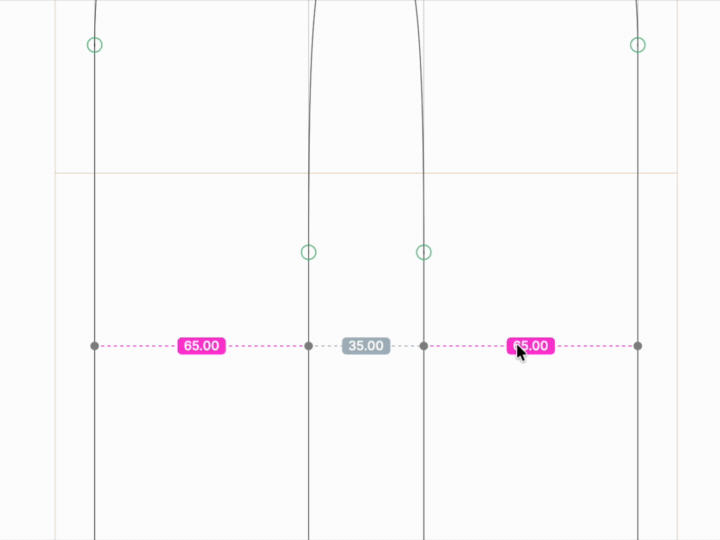

# Ultimate Measure

A Glyphs 3 reporter plugin for live, Figma-style measurement in the Edit View:
stem/edge thickness and point-to-point X/Y distances. It draws only while you
hold **Option**, and what it shows depends on whether a single node is selected.

## Install

**Plugin Manager (recommended).** In Glyphs, open *Window → Plugin Manager*,
find **Ultimate Measure**, click *Install*, and relaunch Glyphs.

**Manual / from source.** Download or clone this repo and put
`UltimateMeasure.glyphsReporter` in your Plugins folder (*Glyphs → Settings →
Addons* shows its location, or `~/Library/Application Support/Glyphs 3/Plugins/`),
then relaunch. If you installed from a downloaded zip and macOS blocks the bundle
on first launch (Plugin Manager installs aren't affected):
`xattr -dr com.apple.quarantine "$HOME/Library/Application Support/Glyphs 3/Plugins/UltimateMeasure.glyphsReporter"`

## Use

Turn it on once in **View → Ultimate Measure**. Nothing shows until Option is
held.

### Nothing selected (or several nodes) — stem ruler

Hold Option and move near an outline. A perpendicular ray measures the stem or
edge under the cursor: a **pink** tag where the span crosses ink, **grey** across
a counter. The origin snaps to a nearby on-curve node (within ~10 px) and locks
to that node's curve normal, so it holds steady rather than wobbling.

At a **corner** the perpendicular is ambiguous, so it switches to axis legs: the
lengths of the *straight* segments meeting at that corner (curve legs are
skipped — the chord to the next point isn't useful), coloured **blue** for the
horizontal leg and **purple** for the vertical. Hovering just outside a corner,
or inside between features, snaps to the vertex instead of firing a diagonal.

**Option + Shift** — full slice: measure every gap across the outline along the
ray, not just the nearest stem.

Everything in this mode is measured on the *visible* outline: a cached,
overlap-removed, decomposed copy of the layer. So overlapping shapes and
components are handled, and overlap crossings behave as real corners.

### One node selected — X/Y to a hovered point

Select a node, hold Option, and hover any node, handle, **or overlap corner**
within ~10 px. It shows the horizontal (**blue, 003BFF**) and vertical (**purple,
8000FF**) distance from the selected node to that point, drawn as a right-angle
connector with the remaining two sides of the rectangle dashed. A leg that is
zero is omitted. (Selecting more than one node falls back to the stem ruler.)

### Hidden

**Option + Command** draws nothing — that combination is Glyphs' zoom gesture.

## Tuning

The behaviour constants — snap and catch radii, dot size, tag geometry, fade
duration and so on — are at the top of `Contents/Resources/plugin.py`, each
commented. Edit and restart Glyphs.

## Notes

- Errors print to **Window → Macro Panel** with an `UltimateMeasure:` prefix.
- The overlap-removed copy is rebuilt only when the outline changes, so hovering
  stays cheap; very heavy glyphs may still cost a little on the first rebuild.

## Credits & licence

A Python port and substantial extension of **StemThickness** by Rafał Buchner,
with code samples by Georg Seifert, Rainer Scheichelbauer and Mark Frömberg.
<https://github.com/RafalBuchner/StemThickness> — the Python loader stub is from
the GlyphsSDK. Licensed under the Apache License 2.0, as the original.
